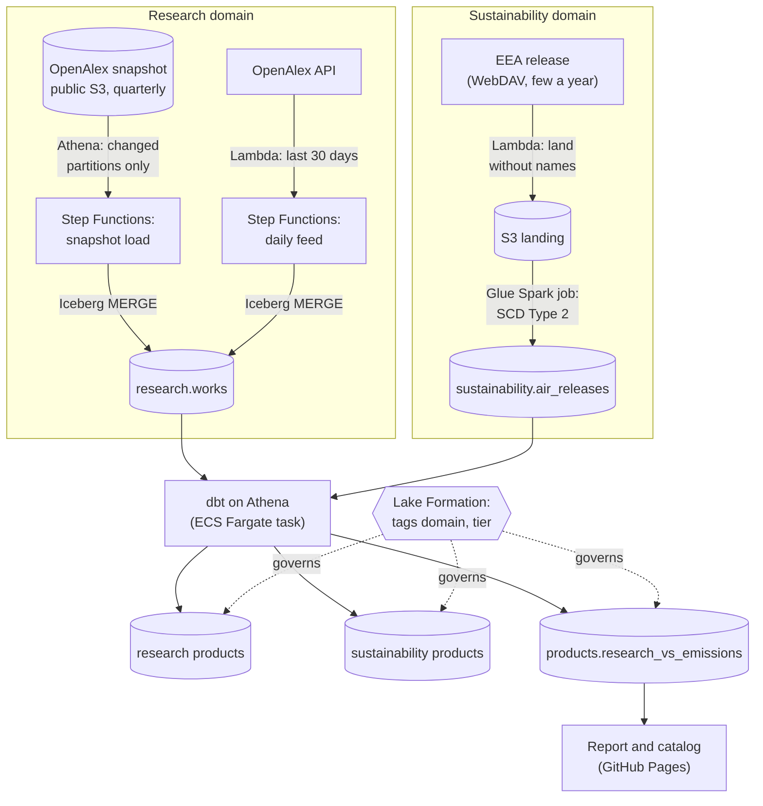
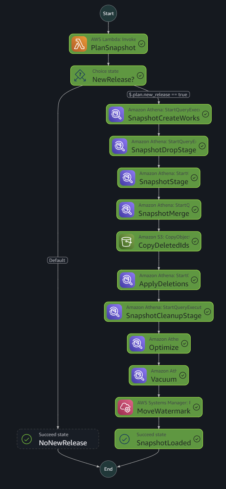
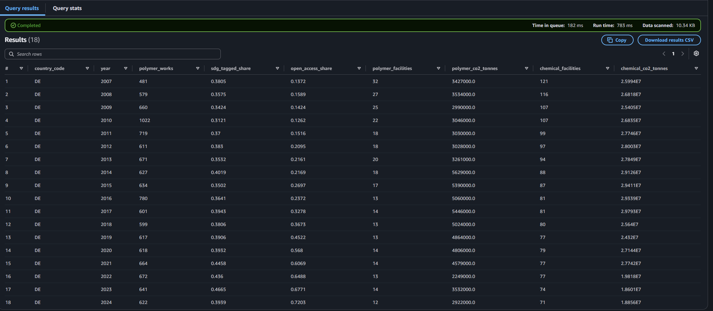
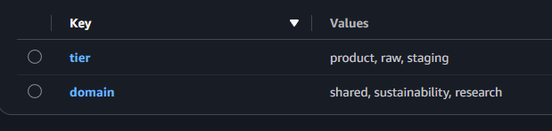

# polymer-research-lakehouse

[](https://github.com/kaeldrin-gh/polymer-research-lakehouse/actions/workflows/ci.yml)
[](https://github.com/kaeldrin-gh/polymer-research-lakehouse/actions/workflows/report.yml)
[](LICENSE)

**[Report and data product catalog](https://kaeldrin-gh.github.io/polymer-research-lakehouse/)** · **[dbt docs](https://kaeldrin-gh.github.io/polymer-research-lakehouse/docs/)**

A small data mesh on AWS for polymer research and industrial sustainability
data. A research domain keeps every polymer and plastics publication in
[OpenAlex](https://openalex.org) current (about 860,000 works); a
sustainability domain loads the European Environment Agency's industrial
emissions register with its revision history; a shared data product puts
research output next to the emissions of polymer plants, per country and
year. Everything is serverless, defined in AWS CDK, and deployed from GitHub
without stored keys.

**Stack:** Python · PySpark · AWS CDK · S3 · Iceberg · Glue (Data Catalog,
Spark jobs) · Athena · Lambda · Step Functions · ECS Fargate · ECR · Lake
Formation · dbt (Athena, DuckDB) · GitHub Actions (OIDC) · uv · ruff

Companion projects:
[de-energy-streaming](https://github.com/kaeldrin-gh/de-energy-streaming)
(streaming lakehouse),
[nl-parliament-warehouse](https://github.com/kaeldrin-gh/nl-parliament-warehouse)
(change data capture into BigQuery),
[nl-energy-warehouse](https://github.com/kaeldrin-gh/nl-energy-warehouse)
(dbt analytics engineering) and
[databricks-energy-quality](https://github.com/kaeldrin-gh/databricks-energy-quality)
(managed lakehouse).

## Where to look first

| If you have | Read |
| --- | --- |
| 2 minutes | The architecture below and the [report](https://kaeldrin-gh.github.io/polymer-research-lakehouse/) |
| 10 minutes | [src/research/sql.py](src/research/sql.py) (incremental stage and Iceberg MERGE) with [tests/test_sql.py](tests/test_sql.py), then [src/sustainability/scd2_sql.py](src/sustainability/scd2_sql.py) and its DuckDB-run tests in [tests/test_sustainability_scd2.py](tests/test_sustainability_scd2.py) |
| The platform side | [infra/stacks/](infra/stacks/): the CDK stacks, with every IAM permission written out, and [infra/stacks/governance.py](infra/stacks/governance.py) for Lake Formation |
| A design discussion | [docs/design.md](docs/design.md): the sources, the measured costs, and the findings from running it on AWS |

## Architecture



- **Research.** A weekly check compares the OpenAlex release with a
  watermark. For a new release, Athena reads only the snapshot partitions
  that changed, and only the columns the table needs, and MERGEs them into
  the Iceberg table `research.works`: the newer version wins, works that left
  the subfield are removed, OpenAlex's deletions are applied, and the
  watermark moves last. A daily feed MERGEs the last 30 days of publications
  from the API in between.
- **Sustainability.** A weekly check finds the newest release of the EEA's
  industrial reporting on its public WebDAV share, lands the air releases
  without facility names or places, and a Glue PySpark job applies them as
  SCD Type 2, so values a later release revises stay visible.
- **Products.** dbt builds each domain's data products and a shared one with
  enforced contracts and tests, as a Fargate task. CI runs the same project
  on DuckDB with committed samples of the real data.
- **Governance.** Lake Formation in hybrid mode: a `product-reader` role can
  read `tier=product` tables only, with file access vended by Lake Formation;
  staging and raw tables are refused. The public page is built as that role.

## Running on AWS

The snapshot load as Step Functions ran it: plan, stage the changed
partitions, MERGE, apply deletions, compact, and move the watermark last.



The shared data product in Athena, for Germany. It reads the domains'
products, not the raw tables, so a query scans kilobytes:



The Lake Formation tags that govern access. The `product-reader` role is
granted `tier=product` and nothing else:



## What it demonstrates

| Capability | Where |
| --- | --- |
| Incremental, idempotent loads | Watermark per source, changed partitions only, MERGE where the newer version wins, watermark moved last; a re-run changes nothing ([findings](docs/design.md#findings-so-far)) |
| Cost measured before spending | Athena reads 8% of the 707 GB snapshot: nested-field and partition pruning measured on one file first; the full load scanned 48 GB for 0.24 USD |
| Change history | SCD Type 2 across EEA releases, tested in DuckDB with revised, withdrawn and confidential values ([tests](tests/test_sustainability_scd2.py)) |
| Data quality | Enforced contracts and dbt tests on every product; warning-level checks list what needs a look (works dated in the future, countries missing from an EEA release) without failing the build; missing years are flagged in a coverage product and the report, never filled in |
| Data mesh | Domains own their buckets, databases, loads and products; products carry owner, freshness target and an enforced contract; the shared product reads products, never raw tables |
| Governance | Lake Formation tags `domain` and `tier`, a reader role governed by tag-based grants, verified from both sides ([governance.py](infra/stacks/governance.py)) |
| Privacy by design | The OpenAlex table definition cannot select author names or ORCIDs; facility names, cities and coordinates are dropped before anything is stored |
| Security | No access keys anywhere: GitHub OIDC with the immutable subject, `aws login` locally; cdk-nag fails the synth on any unexplained wildcard; CloudFormation deploys with a [scoped execution policy](infra/bootstrap/cfn-execution-policy.json), not administrator access |
| Orchestration | Four Step Functions state machines; schedules in EventBridge Scheduler |
| Monitoring | A daily run watch reads each state machine's newest run as a read-only role and opens a GitHub issue when one failed or its schedule stopped firing ([watch.py](monitor/watch.py)); the report shows each product's freshness against its target |
| Containers | dbt in a Docker image on ECS Fargate, in a VPC with no NAT gateway and no inbound traffic |
| Infrastructure as code | Seven CDK stacks in Python with assertion tests (122 tests in all) |

## The numbers

| | |
| --- | --- |
| Polymer and plastics works | 859,181 loaded; 785,851 counted (OpenAlex's xpac works kept, flagged, and left out of the products, as on openalex.org) |
| EEA air releases | 372,178 rows from 27,274 facilities, 2007 to 2024 (release 16) |
| Full OpenAlex reload | 48 GB scanned, 0.24 USD, 8 minutes |
| EEA release load | 2 minutes 47 seconds of Glue Flex, 0.02 USD |
| dbt build on Fargate | 2 minutes 18 seconds, about 0.002 USD |
| AWS spend to date | about 0.55 USD |

## Run locally

No AWS account needed: the tests, the security checks and the dbt project run
on DuckDB with the committed samples.

```bash
uv sync
npm ci

uv run pytest -q                 # unit and CDK assertion tests
uv run ruff check . && uv run ruff format --check .
npx cdk synth --quiet            # CloudFormation templates; cdk-nag fails on findings

uv run python scripts/load_sample.py                      # samples into DuckDB
uv run dbt build --project-dir dbt --profiles-dir dbt     # models and tests
uv run dbt docs generate --project-dir dbt --profiles-dir dbt
uv run python -m report.build --out site                  # site/index.html
```

Account setup, deploys, Lake Formation checks and the rebuild procedure:
[docs/operations.md](docs/operations.md).

## CI/CD

- **ci** (every push): ruff, pytest, CDK assertion tests, the dbt build on
  DuckDB, the report build, and `cdk synth` with cdk-nag. On `main`, it then
  deploys the stacks through a GitHub OIDC role that only this repository's
  `main` branch can assume.
- **report** (daily): builds the page from Athena as the product-reader role
  and publishes it to GitHub Pages.
- **watch** (daily): checks the newest run of every state machine as a
  read-only monitor role; a failed run or a schedule that stopped firing
  opens a GitHub issue and fails the workflow.

## Known limitations

- **A free-plan AWS account.** It runs for six months from 6 October 2026;
  after that, CI keeps running everything except the deploy, and the page
  keeps its last build. Built to cost a few dollars in total.
- **Not production.** One account for development and use, hybrid Lake
  Formation mode (the pipeline roles are still governed by IAM), and alerts
  as GitHub issues only.
- **The OpenAlex API feed's window.** Works OpenAlex indexes late with old
  publication dates wait for the next quarterly snapshot.
- **The EEA keeps only its newest release online**, so the revision history
  starts with the first load.

## Layout

```
infra/               CDK app: data lake, research and sustainability pipelines,
                     products build, governance, run-watch role, GitHub deploy role
src/research/        OpenAlex loads: release planning, SQL, API feed, Lambda handlers
src/sustainability/  EEA loads: release discovery, landing, SCD Type 2 SQL
jobs/                Glue PySpark job
dbt/                 dbt project (Athena and DuckDB targets), seeds, tests
docker/dbt/          dbt image for ECS Fargate
report/              report and data product catalog page
monitor/             run watch: latest state machine runs, report for the issue
sample/              committed samples of the real data
scripts/             sample builders and loader
docs/                design (with findings) and operations
tests/               Python unit and CDK assertion tests
```

## License

MIT, see [LICENSE](LICENSE). OpenAlex data is CC0. EEA industrial reporting
data (including `sample/sustainability_air_releases.parquet`) is CC BY 4.0
© European Environment Agency.
