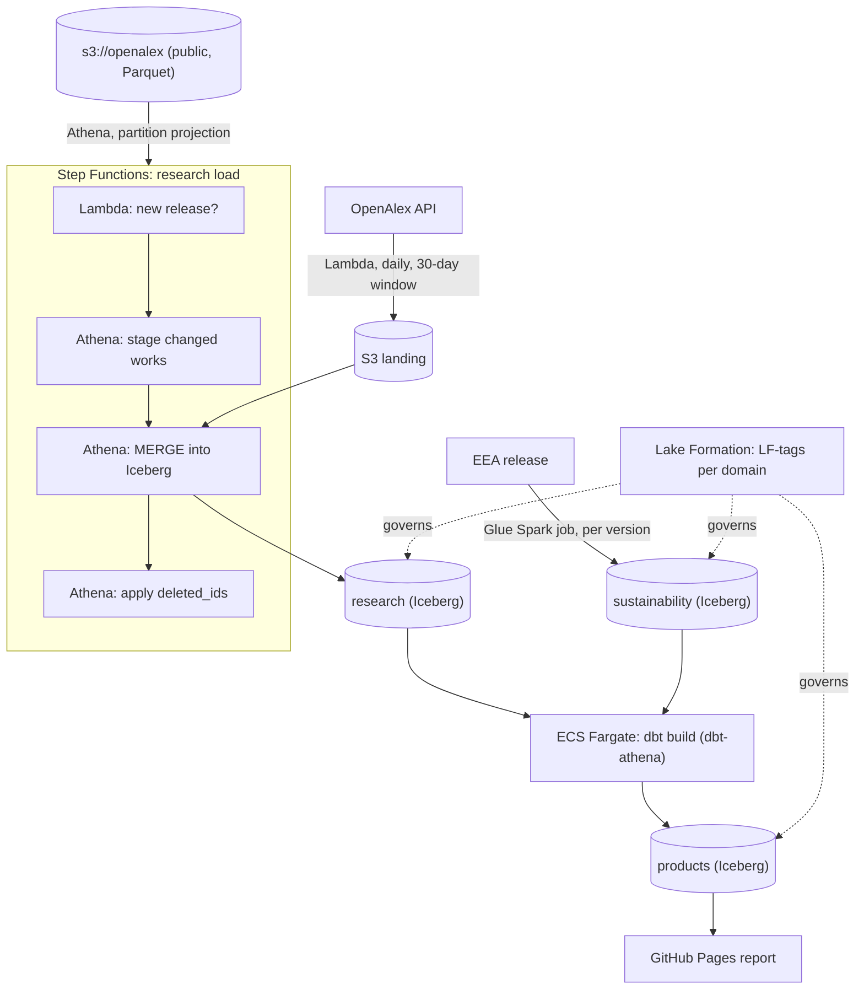

# Design: polymer-research-lakehouse (working name)

Status: 6 October 2026. Approved. M0 is done. The code of both domains (load
pipelines, dbt products, shared product) is written and tested without AWS,
so M2 to M4 are mostly deploying and verifying it. No AWS account yet.

## Objective

Build a small data mesh on AWS for polymer research and industrial
sustainability data. Two domain teams (simulated) each own their data
products, and a shared product joins them. Everything runs serverless, is
defined in AWS CDK, and stays inside the AWS free account plan.

The project exists to show the work that the author's other four repositories
cannot:

- AWS: S3, Glue (Data Catalog and a Spark job), Athena, Lambda, ECS Fargate
  with ECR, Step Functions, Lake Formation, CloudWatch and CDK.
- A data mesh: domain ownership, data products with contracts, a catalog with
  tag-based access control, and lineage.
- Research and sustainability data, close to an industrial R&D setting.

### Non-goals

- Judging researchers, institutions or companies. Outputs are counts and rates
  with their definitions next to them.
- Full-text or abstract analysis. The design skips abstracts, the largest
  column in the source (see the cost section).
- A production system. The account lives about six months (see Lifecycle).

## Background

### Source 1: OpenAlex snapshot (research domain)

[OpenAlex](https://openalex.org) is an open catalogue of scholarly works under
CC0. Tests on 5 October 2026 established:

- The full database is a public S3 bucket, `s3://openalex`, in `us-east-1`,
  as Parquet and JSON lines. Release 2026-09-23 holds 476 million works in
  2,040 Parquet files (707 GB).
- Releases are quarterly: the second Wednesday of January, April, July and
  October. The next is 14 October 2026. A `manifest.json` is written last, so
  its presence marks a complete release.
- Works are partitioned by `updated_date`. Each partition holds only the
  records that last changed on that date, so the bucket is always the complete
  current database. To update a copy made on date X, load only partitions with
  `updated_date > X` and upsert by `id`. Deleted works are listed in a
  cumulative `deleted_ids.csv.gz`.
- The scope is the subfield **Polymers and Plastics** (OpenAlex subfield 2507,
  field Materials Science): 783,432 works, about 30,000 per year; 701 works in
  2025 had a German institution.
- Works carry UN Sustainable Development Goal tags, the link to the
  sustainability domain.
- The API (`api.openalex.org`) is free for list queries, with a daily budget
  of 0.10 USD without a key (one list call costs 0.001 USD). The change
  filters `from_updated_date` and `from_created_date` need a paid plan, so the
  daily feed uses a publication-date window instead.

Column sizes from the Parquet footers of six random files (share of all
compressed bytes): abstracts 34.5%, authorships 10.5%, title 4.1%,
primary_topic 0.8%, id 0.7%, SDG tags 0.2%. Files have one or a few row
groups, and the subfield is not sorted, so Athena cannot skip row groups; it
reads every selected column in full.

### Source 2: EEA industrial reporting (sustainability domain)

The European Environment Agency publishes
[Industrial Reporting under the IED and E-PRTR](https://sdi.eea.europa.eu/catalogue/srv/api/records/9f373400-35b7-4978-9a34-a3cf839e053f)
under CC BY 4.0: facilities, pollutant releases (kg/year), waste transfers and
energy input for about 31 European countries, 2007 to 2024.

Tests on 6 October 2026 established:

- **Access.** Every release sits in one public Nextcloud share (token
  `sptXqwkQr5g7Bp5`), readable over WebDAV without an account:
  `PROPFIND` on `https://sdi.eea.europa.eu/datashare/public.php/dav/files/<token>/`
  lists the folders, and a plain `GET` downloads a file.
- **Release discovery.** Tabular releases are folders named
  `eea_t_ied-eprtr_p_<years>_v<NN>_r00`; the newest is the highest `vNN`
  (v16, 20 February 2026, data 2007 to 2024). New versions appear a few times
  a year (v14 March 2025, v15 December 2025, v16 February 2026).
- **Only the newest version keeps its data.** Superseded tabular folders hold
  metadata only (v13 still has a 1.8 GB Access database, nothing usable
  without extra tooling). So no past versions can be backfilled: the release
  history starts with the first load, and each later version adds to it.
- **Files.** `User friendly .csv files.zip` (148 MB, about 6 seconds to
  download) holds 16 CSV files (UTF-8 with BOM, CRLF, comma-separated, decimal
  point). The sustainability domain needs one:
  `F1_4_Air_Releases_Facilities.csv` (73 MB, 372,206 rows): releases to air
  per facility, pollutant and reporting year, in kg/year, for 32 countries,
  named in English (no ISO codes).
- **Key.** Facility (`FacilityInspireId`), reporting year and pollutant. It is
  unique except for 17 rows with pollutant `CONFIDENTIAL` and no value; 78
  rows have a null release with a confidentiality reason; 4,985 rows have no
  sector.
- **The polymer link.** E-PRTR Annex I activity `4(a)(viii)` (sector 4,
  chemical industry) is the production of plastic materials: polymers and
  synthetic fibres. 59 such facilities reported air releases for 2024.
- **Personal data.** Facility names in some sectors are people's names (for
  example family-run livestock farms), and coordinates and cities locate them.
  The load keeps the facility ID and drops names, cities and coordinates.

## Design

### Domains and data products

| Domain | Owns | Data products |
| --- | --- | --- |
| research | OpenAlex polymer works | `research.works` (one row per work, current), `research.works_by_country_year`, `research.topic_trends` |
| sustainability | EEA industrial reporting | `sustainability.air_releases` (SCD Type 2 across EEA versions), `sustainability.chemical_sector_by_country_year` (polymer production plants separately), `sustainability.air_release_revisions` |
| shared | joins products, owns nothing raw | `products.research_vs_emissions` (per country and year: polymer research output, its SDG-tagged share, polymer plants' and chemical industry's CO2) |

Each data product is described in its dbt model's YAML: owner, domain,
description, freshness SLA (`meta`), an enforced schema contract and its data
tests. The dbt manifest therefore holds every descriptor, and feeds the
catalog page.

### Architecture

Region `us-east-1`, the region of the OpenAlex bucket. Athena then reads the
source without cross-region transfer. The data is public, so data residency
does not apply.

Components:

- **Storage**: one S3 bucket per domain, Iceberg tables in the Glue Data
  Catalog, one Glue database per domain. S3-managed encryption, no KMS key.
- **Source table**: an external Athena table over `s3://openalex` with
  partition projection on `updated_date`, so no Glue crawler is needed.
- **Research load (Step Functions)**: a Lambda reads `manifest.json` and
  compares its date with the watermark (an SSM parameter). If there is a new
  release, Athena stages the polymer works from partitions after the
  watermark, MERGEs them into `research.works` by `id` (newer `updated_date`
  wins), deletes works listed in `deleted_ids`, then moves the watermark.
  `OPTIMIZE` and `VACUUM` keep the Iceberg table small.
- **Daily feed (Lambda + EventBridge Scheduler)**: polymer works published in
  the last 30 days, from the API, as JSON lines in S3 landing; the same MERGE
  applies them. This gives freshness between quarterly releases.
- **Sustainability load (Lambda + Glue Spark job)**: a Lambda lists the EEA
  share, and if a newer `vNN` exists, downloads the zip and lands the air
  releases CSV in S3 (without names, cities or coordinates). A Glue PySpark
  job then MERGEs it into the Iceberg table `sustainability.air_releases`,
  keeping every reported value with the version range it was valid in
  (`valid_from_version`, `valid_to_version`; SCD Type 2), so a value a later
  version revises stays visible. Countries map to ISO codes through a dbt
  seed.
- **Transformations (dbt on ECS Fargate)**: a Docker image with dbt-athena,
  built in CI and stored in ECR. Step Functions runs it as a Fargate task after
  each load. The same dbt project runs on DuckDB with sample data in CI.
- **Governance (Lake Formation)**: LF-tags `domain` and `tier`
  (`raw`, `product`). Each domain has a producer role that can write only its
  own databases; an analyst role can read only `tier=product`. All grants are
  CDK code.
- **Lineage and catalog**: dbt emits OpenLineage events (`dbt-ol`) to S3; a
  build step combines them with the dbt manifest (which holds the product
  descriptors) into a static catalog page on GitHub Pages.
- **Observability**: a CloudWatch dashboard (executions, Lambda errors, Athena
  bytes scanned), log retention of 14 days, and a quality-results table. A
  daily GitHub Actions workflow reads the last execution status and opens a
  GitHub issue on failure. No email or SNS notifications.

### CI/CD

- **Every push**: ruff, pytest, CDK assertion tests and cdk-nag security
  checks, `cdk synth`, dbt build on DuckDB, Docker build. None of these need
  AWS, so CI keeps working after the account closes.
- **Main branch**: `cdk deploy` through a GitHub OIDC role. No access keys
  exist anywhere. The role trusts only this repository's `main` branch.
- **Tooling**: uv for packages and lock file, ruff, Python 3.12.

### Cost

Free account plan: 100 USD credits (up to 200 USD), six months. Target: under
5 USD a month, so the six-month limit, not the credits, ends the project.

| Item | Estimate |
| --- | --- |
| First backfill: Athena reads the staged columns, and only the institution fields inside `authorships` (8.0% of the bytes, measured on 6 October 2026) | about 57 GB, 0.28 USD once |
| Quarterly update (the September release rewrote about half the data) | about 0.15 USD per release |
| Daily API feed | 0.01 to 0.02 USD a day of the free API budget; Lambda free |
| Fargate dbt run (0.25 vCPU, 0.5 GB, a few minutes) | under 0.10 USD a month |
| Glue Spark job (2 DPU, a few minutes, per EEA version) | under 0.10 USD per run |
| S3, Step Functions, CloudWatch | under 1 USD a month |

Guardrails, all in CDK:

- An Athena workgroup with a per-query scan limit (200 GB) and an S3 lifecycle
  rule on query results.
- No NAT gateway, EC2, RDS, Glue crawler, KMS key or Secrets Manager secret.
  Fargate runs in a public subnet of the default VPC.
- The backfill reads no abstracts; a test asserts the staging query's column
  list.

### Lifecycle

- The account plan ends six months after sign-up. In month five: export the
  final products to the repository and GitHub Pages, take screenshots, and
  state in the README when the project ran live on AWS.
- After the account closes, CI still runs everything except the deploy. The
  deploy step skips with a notice when the AWS role is not configured, the same
  pattern as databricks-energy-quality.

### Security

- Root user: MFA, no access keys, used only for setup.
- Local work: an IAM user with MFA and `aws login`, which turns the console
  sign-in into short-lived CLI credentials. Not IAM Identity Center: it needs
  AWS Organizations, which ends the free plan.
- CI: OIDC role only. Workflow logs mask the account ID.

## Milestones

| Milestone | Content | Needs the AWS account |
| --- | --- | --- |
| M0 | Repository, CDK skeleton, tests, CI without AWS | No |
| M1 | Account setup, CDK bootstrap, OIDC role; measure Athena bytes on one OpenAlex partition | Yes (day 1) |
| M2 | Research domain: backfill, incremental MERGE, deletions, daily feed, Step Functions | Yes |
| M3 | dbt on Fargate (dbt-athena) and DuckDB; quality checks; research products | Yes |
| M4 | Sustainability domain (Glue job, SCD Type 2); Lake Formation tags and roles; shared product | Yes |
| M5 | Lineage and catalog page, report on Pages, dashboard, README, screenshots | Partly |

M0 needs no account, so the six-month clock starts only at M1.

## Alternatives considered

- **LocalStack or another emulator instead of AWS.** The free LocalStack
  edition ended in March 2026, and Glue, Athena and Step Functions were never
  in it. Rejected: the point is real AWS.
- **NOMAD materials database.** Large (19 million entries) but few new public
  uploads (9 in the week before 5 October 2026), so a weak incremental source.
- **OpenAlex API only.** Its change filters need a paid plan; a
  publication-date window misses works indexed late. The snapshot gives exact
  incremental loads; the API only adds freshness.
- **Region eu-central-1 (Frankfurt).** Closer to the German market, but every
  OpenAlex read would cross regions. Rejected for cost and simplicity.
- **AWS DataZone for the catalog.** Paid per user after its free tier and
  heavy for one person. A static catalog page from the descriptors, the dbt
  manifest and OpenLineage covers the same story.

## Findings so far

- **Athena reads only what the stage selects (measured 6 October 2026).** On
  the partition `updated_date=2026-05-22` (one 373 MB file, 303,880 works, 751
  of them polymer works):
  - the subfield filter scanned 0.30 MB: only the `primary_topic.subfield.id`
    leaf, not the 3.2 MB struct;
  - the full staging SELECT scanned 29.99 MB: the Parquet footer predicts
    30.9 MB when Athena reads only the institution `id` and `country_code`
    inside `authorships`, and 71.6 MB when it reads whole columns. So the
    narrowed table definition halves the cost as well as hiding author
    identities;
  - the range predicate the stage uses (`> '2026-05-21' AND <= '2026-05-22'`)
    scanned the same 29.99 MB as an equality on the date: partition
    projection prunes ranges.

  8.0% of the bytes, times the 707 GB snapshot, puts the first backfill at
  about 57 GB, or 0.28 USD.
- **The daily feed works end to end on AWS (6 October 2026).** The first run
  landed 1,666 works in 8 seconds and merged them into the Iceberg table
  `research.works`: 1,666 rows, 1,666 IDs, `timestamp(6)` columns, one Iceberg
  snapshot. Dropping the staging table removed all its S3 objects. A second
  run on the same day changed no row and wrote no new snapshot: the MERGE is
  idempotent.
- **The EEA load works end to end on AWS (6 October 2026).** The Lambda found
  release v16, downloaded it and landed 372,178 rows in 46 seconds (512 MB,
  ARM). The Glue job (Glue 5, Flex, 2 workers) applied them in 150 seconds
  of run time, 2 minutes 47 seconds including the Flex start: 210
  DPU-seconds, about 0.02 USD. The planned SQL (2.2 KB) passed as a job
  argument. Athena reads the Iceberg table Glue wrote through the shared
  catalog: 372,178 current rows, version 16, no duplicate keys. A second run
  saw v16 already loaded and finished in 2 seconds without starting Glue.
- **dbt runs on Athena unchanged (6 October 2026).** The same project that
  CI runs on DuckDB built every product on Athena on the first try, from a
  laptop with short-lived credentials: 4 views, 5 Iceberg tables and the
  seed, 49 data tests passing and one warning, the 23 works dated beyond the
  current year. Each product's files landed in its domain's bucket. Sample
  row, Germany 2024: 622 polymer works, 12 polymer plants releasing 2.92 Mt
  of CO2, 18.9 Mt from the whole chemical industry.
- **Step Functions waits about 60 seconds per Athena step.** The queries take
  1 to 2 seconds; the rest is how often the `.sync` integration checks a
  query. Five steps make a 5-minute run. That is fine for a daily batch, so it
  stays; running the statements from a Lambda would be faster but would hide
  each step from the execution history.

- **Future publication dates.** A live run of the daily feed on 5 October 2026
  returned 1,670 works published since 5 September; 8 were dated in the
  future, 4 more than a year ahead (as late as 1 January 2031), several of
  them dissertations dated by their embargo end. Rule, in dbt: a date later in
  the current year counts; a later year is flagged, left out of per-year
  products and listed by a warning test.
- **Works without a publication year.** A few sampled works have none (33 of
  the 3,000 in the current sample); per-year products leave them out.
- **xpac works: the snapshot and the API disagree by default (6 October
  2026).** The first backfill loaded 858,835 polymer works, while the API
  reported 808,025 for the same subfield. The difference is OpenAlex's *xpac*
  ("expansion pack") set: works from newer sources with thinner metadata,
  mostly articles and dissertations. OpenAlex's API and website hide them
  unless asked (`include_xpac=true`); the snapshot contains everything and
  marks them with `is_xpac`. In the polymer subfield the API counts 808,025
  works without xpac and 895,909 with it.

  Left alone, the two loads would deliver different sets: the snapshot with
  xpac works, the daily feed without. The decision:
  - **Keep them, flagged.** `research.works` has an `is_xpac` column; the
    snapshot stage reads it (3 KB per file) and the daily feed asks the API
    for xpac works too, so both loads deliver the same set. Nothing is lost
    if a consumer wants them later.
  - **The products follow OpenAlex's default.** `int_research__countable_works`
    leaves xpac works out, so the research products count what anyone sees on
    openalex.org. A dbt unit test pins the rule.
  - Dropping xpac works at load time was the alternative: simpler, but the
    data would be gone, and the table would no longer be a complete copy of
    the subfield.

  Adding the column needed a rebuild of `research.works`: an existing row only
  changes when OpenAlex changes the work, so a re-run would not fill the new
  column. The rebuild is a dropped table, a deleted watermark and a fresh
  backfill (`docs/operations.md`, about 0.24 USD).

  After the rebuild on 6 October 2026: 859,181 works, all with `is_xpac`
  set (73,330 xpac, 785,851 not); 857,629 from the 2026-09-23 snapshot and
  1,552 from the daily feed. The API then counted 808,025 works without xpac;
  the difference is works OpenAlex added after the snapshot with older
  publication dates, outside the feed's 30-day window. The next quarterly
  snapshot (14 October 2026) brings them in, as designed.
- **CDK's Athena task grants too much.** Without its own result location (the
  workgroup enforces one), `AthenaStartQueryExecution` grants S3 writes on
  every bucket. The state machines use the raw `.sync` integration with
  written-out permissions instead.

## Open questions

The EEA download path was answered on 6 October 2026 (see Source 2).

1. **Athena on Lake Formation-governed Iceberg tables.** Lake Formation adds
   permission checks to every Athena and Glue call; test early in M2 so the
   grants model is right before the domains grow.
2. **Name.** `polymer-research-lakehouse` is a working name; alternatives:
   `polymer-rnd-data-mesh`, `materials-data-mesh-aws`.
