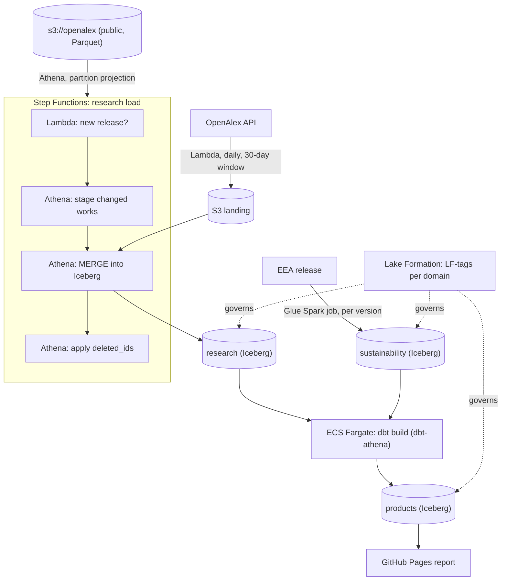

# Design: polymer-research-lakehouse (working name)

Status: 5 October 2026. Approved. M0 is done, and the research domain's load
code (part of M2) is written and tested without AWS. No AWS account yet.

## Objective

Build a small data mesh on AWS for polymer research and industrial
sustainability data. Two domain teams (simulated) each own their data
products, and a shared product joins them. Everything runs serverless, is
defined in AWS CDK, and stays inside the AWS free account plan.

The project exists to show the work that the author's other four repositories
cannot:

- AWS: S3, Glue (Data Catalog and a Spark job), Athena, Lambda, ECS Fargate
  with ECR, Step Functions, Lake Formation, CloudWatch and CDK.
- A data mesh: domain ownership, data products with contracts, a catalog with
  tag-based access control, and lineage.
- Research and sustainability data, close to an industrial R&D setting.

### Non-goals

- Judging researchers, institutions or companies. Outputs are counts and rates
  with their definitions next to them.
- Full-text or abstract analysis. The design skips abstracts, the largest
  column in the source (see the cost section).
- A production system. The account lives about six months (see Lifecycle).

## Background

### Source 1: OpenAlex snapshot (research domain)

[OpenAlex](https://openalex.org) is an open catalogue of scholarly works under
CC0. Tests on 5 October 2026 established:

- The full database is a public S3 bucket, `s3://openalex`, in `us-east-1`,
  as Parquet and JSON lines. Release 2026-09-23 holds 476 million works in
  2,040 Parquet files (707 GB).
- Releases are quarterly: the second Wednesday of January, April, July and
  October. The next is 14 October 2026. A `manifest.json` is written last, so
  its presence marks a complete release.
- Works are partitioned by `updated_date`. Each partition holds only the
  records that last changed on that date, so the bucket is always the complete
  current database. To update a copy made on date X, load only partitions with
  `updated_date > X` and upsert by `id`. Deleted works are listed in a
  cumulative `deleted_ids.csv.gz`.
- The scope is the subfield **Polymers and Plastics** (OpenAlex subfield 2507,
  field Materials Science): 783,432 works, about 30,000 per year; 701 works in
  2025 had a German institution.
- Works carry UN Sustainable Development Goal tags, the link to the
  sustainability domain.
- The API (`api.openalex.org`) is free for list queries, with a daily budget
  of 0.10 USD without a key (one list call costs 0.001 USD). The change
  filters `from_updated_date` and `from_created_date` need a paid plan, so the
  daily feed uses a publication-date window instead.

Column sizes from the Parquet footers of six random files (share of all
compressed bytes): abstracts 34.5%, authorships 10.5%, title 4.1%,
primary_topic 0.8%, id 0.7%, SDG tags 0.2%. Each file is one row group, so
Athena cannot skip row groups; it reads every selected column in full.

### Source 2: EEA industrial reporting (sustainability domain)

The European Environment Agency publishes
[Industrial Reporting under the IED and E-PRTR](https://sdi.eea.europa.eu/catalogue/srv/api/records/9f373400-35b7-4978-9a34-a3cf839e053f)
under CC BY 4.0: facilities, pollutant releases (kg/year), waste transfers and
energy input for about 31 European countries, 2007 to 2024.

- New versions appear a few times a year (15.0 in December 2025, 16.0 in
  February 2026). A new version can revise earlier years.
- Downloads are a Nextcloud share (Geopackage, GDB and tabular formats). The
  exact automated download path is still open (see Open questions).

## Design

### Domains and data products

| Domain | Owns | Data products |
| --- | --- | --- |
| research | OpenAlex polymer works | `research.works` (one row per work, current), `research.works_by_country_year`, `research.topic_trends` |
| sustainability | EEA industrial reporting | `sustainability.facility_releases` (SCD Type 2 across EEA versions), `sustainability.chemical_sector_by_country_year` |
| shared | joins products, owns nothing raw | `products.research_vs_emissions` (per country and year: polymer research output, its SDG-tagged share, chemical-sector releases) |

Each data product has a YAML descriptor in the repository: owner, domain,
description, schema contract, freshness SLA and quality checks. dbt contracts
enforce the schema; the descriptor feeds the catalog page.

### Architecture

Region `us-east-1`, the region of the OpenAlex bucket. Athena then reads the
source without cross-region transfer. The data is public, so data residency
does not apply.

Components:

- **Storage**: one S3 bucket per domain, Iceberg tables in the Glue Data
  Catalog, one Glue database per domain. S3-managed encryption, no KMS key.
- **Source table**: an external Athena table over `s3://openalex` with
  partition projection on `updated_date`, so no Glue crawler is needed.
- **Research load (Step Functions)**: a Lambda reads `manifest.json` and
  compares its date with the watermark (an SSM parameter). If there is a new
  release, Athena stages the polymer works from partitions after the
  watermark, MERGEs them into `research.works` by `id` (newer `updated_date`
  wins), deletes works listed in `deleted_ids`, then moves the watermark.
  `OPTIMIZE` and `VACUUM` keep the Iceberg table small.
- **Daily feed (Lambda + EventBridge Scheduler)**: polymer works published in
  the last 30 days, from the API, as JSON lines in S3 landing; the same MERGE
  applies them. This gives freshness between quarterly releases.
- **Sustainability load (Glue Spark job)**: runs when a new EEA version
  appears; converts the release to Iceberg and keeps every reported value with
  `valid_from` and `valid_to` per EEA version (SCD Type 2), so revisions are
  visible.
- **Transformations (dbt on ECS Fargate)**: a Docker image with dbt-athena,
  built in CI and stored in ECR. Step Functions runs it as a Fargate task after
  each load. The same dbt project runs on DuckDB with sample data in CI.
- **Governance (Lake Formation)**: LF-tags `domain` and `tier`
  (`raw`, `product`). Each domain has a producer role that can write only its
  own databases; an analyst role can read only `tier=product`. All grants are
  CDK code.
- **Lineage and catalog**: dbt emits OpenLineage events (`dbt-ol`) to S3; a
  build step combines them with the dbt manifest and the product descriptors
  into a static catalog page on GitHub Pages.
- **Observability**: a CloudWatch dashboard (executions, Lambda errors, Athena
  bytes scanned), log retention of 14 days, and a quality-results table. A
  daily GitHub Actions workflow reads the last execution status and opens a
  GitHub issue on failure. No email or SNS notifications.

### CI/CD

- **Every push**: ruff, pytest, CDK assertion tests and cdk-nag security
  checks, `cdk synth`, dbt build on DuckDB, Docker build. None of these need
  AWS, so CI keeps working after the account closes.
- **Main branch**: `cdk deploy` through a GitHub OIDC role. No access keys
  exist anywhere. The role trusts only this repository's `main` branch.
- **Tooling**: uv for packages and lock file, ruff, Python 3.12.

### Cost

Free account plan: 100 USD credits (up to 200 USD), six months. Target: under
5 USD a month, so the six-month limit, not the credits, ends the project.

| Item | Estimate |
| --- | --- |
| First backfill: Athena reads id, doi, title, dates, type, primary_topic, SDGs, open_access, citations, authorships (about 19% of 707 GB) | about 130 GB, 0.65 USD once |
| Quarterly update (the September release rewrote about half the data) | 0.30 to 0.65 USD per release |
| Daily API feed | 0.01 to 0.02 USD a day of the free API budget; Lambda free |
| Fargate dbt run (0.25 vCPU, 0.5 GB, a few minutes) | under 0.10 USD a month |
| Glue Spark job (2 DPU, a few minutes, per EEA version) | under 0.10 USD per run |
| S3, Step Functions, CloudWatch | under 1 USD a month |

Guardrails, all in CDK:

- An Athena workgroup with a per-query scan limit (200 GB) and an S3 lifecycle
  rule on query results.
- No NAT gateway, EC2, RDS, Glue crawler, KMS key or Secrets Manager secret.
  Fargate runs in a public subnet of the default VPC.
- The backfill reads no abstracts; a test asserts the staging query's column
  list.

### Lifecycle

- The account plan ends six months after sign-up. In month five: export the
  final products to the repository and GitHub Pages, take screenshots, and
  state in the README when the project ran live on AWS.
- After the account closes, CI still runs everything except the deploy. The
  deploy step skips with a notice when the AWS role is not configured, the same
  pattern as databricks-energy-quality.

### Security

- Root user: MFA, no access keys, used only for setup.
- Local work: IAM Identity Center (free) for short-lived CLI credentials.
- CI: OIDC role only. Workflow logs mask the account ID.

## Milestones

| Milestone | Content | Needs the AWS account |
| --- | --- | --- |
| M0 | Repository, CDK skeleton, tests, CI without AWS | No |
| M1 | Account setup, CDK bootstrap, OIDC role; measure Athena bytes on one OpenAlex partition | Yes (day 1) |
| M2 | Research domain: backfill, incremental MERGE, deletions, daily feed, Step Functions | Yes |
| M3 | dbt on Fargate (dbt-athena) and DuckDB; quality checks; research products | Yes |
| M4 | Sustainability domain (Glue job, SCD Type 2); Lake Formation tags and roles; shared product | Yes |
| M5 | Lineage and catalog page, report on Pages, dashboard, README, screenshots | Partly |

M0 needs no account, so the six-month clock starts only at M1.

## Alternatives considered

- **LocalStack or another emulator instead of AWS.** The free LocalStack
  edition ended in March 2026, and Glue, Athena and Step Functions were never
  in it. Rejected: the point is real AWS.
- **NOMAD materials database.** Large (19 million entries) but few new public
  uploads (9 in the week before 5 October 2026), so a weak incremental source.
- **OpenAlex API only.** Its change filters need a paid plan; a
  publication-date window misses works indexed late. The snapshot gives exact
  incremental loads; the API only adds freshness.
- **Region eu-central-1 (Frankfurt).** Closer to the German market, but every
  OpenAlex read would cross regions. Rejected for cost and simplicity.
- **AWS DataZone for the catalog.** Paid per user after its free tier and
  heavy for one person. A static catalog page from the descriptors, the dbt
  manifest and OpenLineage covers the same story.

## Findings so far

- **Future publication dates.** A live run of the daily feed on 5 October 2026
  returned 1,670 works published since 5 September, some dated as late as
  1 January 2031. The dbt tests (M3) need a rule for these.
- **CDK's Athena task grants too much.** Without its own result location (the
  workgroup enforces one), `AthenaStartQueryExecution` grants S3 writes on
  every bucket. The state machines use the raw `.sync` integration with
  written-out permissions instead.

## Open questions

1. **EEA download path.** Confirm a stable, scriptable URL for the tabular
   release (Nextcloud public share or EEA Discodata SQL). Fallback: the
   sustainability domain starts from one manually downloaded version committed
   as a pinned input, with automated updates later.
2. **Athena on Lake Formation-governed Iceberg tables.** Lake Formation adds
   permission checks to every Athena and Glue call; test early in M2 so the
   grants model is right before the domains grow.
3. **Name.** `polymer-research-lakehouse` is a working name; alternatives:
   `polymer-rnd-data-mesh`, `materials-data-mesh-aws`.
